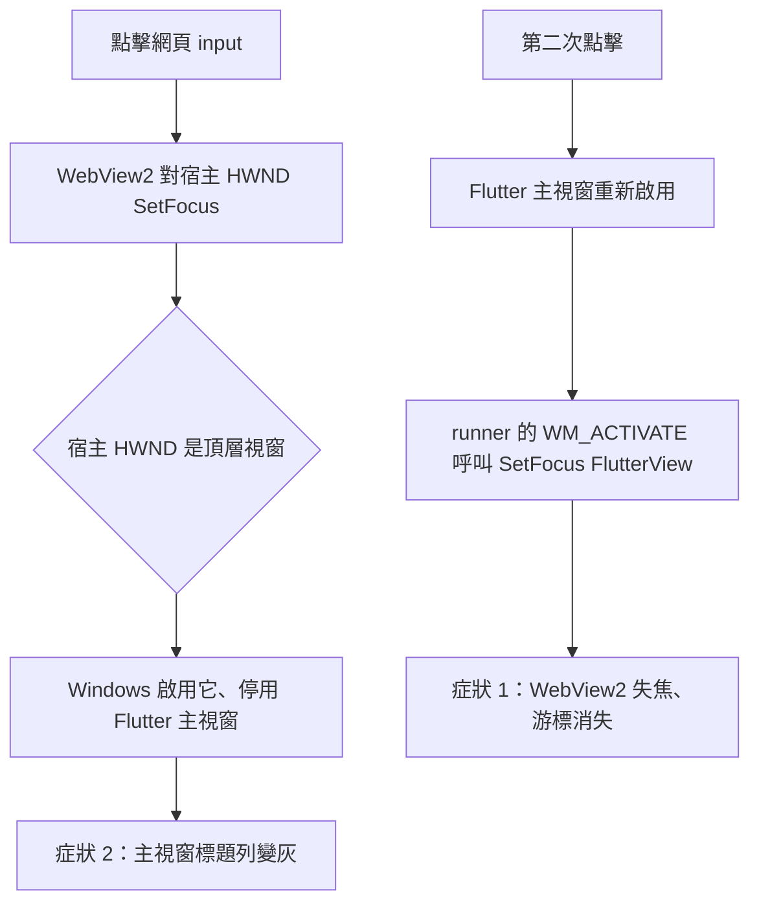

# Plan: 2608201704 - Windows WebView 焦點與視窗啟用修正
- Created: 2026-08-20
- Branch: fix/2608201704-windows-webview-focus
- Issue: KNightING/flutter_inappwebview#18
- Status: Awaiting Archive
- Completed: 2026-08-20

## Goals

修正 Windows 平台上點擊網頁 `input` 的兩個症狀：

1. 第一下點擊會 focus、第二下 focus 消失（焦點在 FlutterView 與 WebView2 之間來回拉扯）。
2. `input` 取得焦點時，Windows 應用程式視窗本身失去啟用狀態（標題列變灰）。

兩者是同一個根因的兩面：WebView2 的宿主 HWND 被建立成頂層視窗而非子視窗。

## Architecture

### 現況

`InAppWebViewManager::createInAppWebView` 為每個 WebView 建立一個宿主 HWND，交給
`CreateCoreWebView2CompositionController(parentWindow, ...)` 當 parent。畫面走 texture，
輸入由 Dart 端合成後以 `SendMouseInput` / `SendPointerInput` 送進去；鍵盤與 IME 則不經
Flutter，由 WebView2 透過這個宿主 HWND 自行取得。

問題在 `CreateWindowEx` 的 `dwStyle` 是 `0`：

```
CreateWindowEx(0, windowClass_.lpszClassName, L"", 0, ...)
                                                   ^ 沒有 WS_CHILD
```

Win32 的規則是「有 `hWndParent` 但沒有 `WS_CHILD`」時，該參數只作為 **owner**，視窗本身
仍是**頂層視窗**。

### 失效鏈



旁證：`InAppWebView::setPosition` 以**螢幕座標**計算並手動扣除標題列與邊框高度
（`GetSystemMetrics(SM_CYCAPTION)` 等）。只有頂層視窗需要這種算法，正好印證現況。

### 修正方向（Phase 1）

宿主 HWND 加上 `WS_CHILD`，**不加 `WS_VISIBLE`**：

- 焦點在同一個頂層視窗內轉移，不再觸發視窗啟用切換 → 症狀 2 消失。
- 主視窗不再被停用，就不會有「重新啟用 → runner 搶回焦點」那一步 → 症狀 1 消失。
- 不加 `WS_VISIBLE`：可見的子視窗會疊在 FlutterView 之上並攔截滑鼠訊息，會把 Flutter 端
  的輸入合成整條打斷；隱藏的視窗不參與 hit-test，但仍可持有 Win32 焦點與 IME。畫面本來
  就走 texture，這個 HWND 從不需要被畫出來。

連帶：`setPosition` 的座標語意由螢幕座標改為 parent client 座標，那段標題列／邊框扣算
一併移除。此位置只影響 WebView2 自繪的原生彈出物（`<select>` 下拉、右鍵選單、自動填入、
IME 候選字視窗）的落點，不影響 texture 內容。

Headless 路徑（`headless_in_app_webview_manager.cpp:72`）不在本次範圍：它的宿主視窗建立後
立即 `ShowWindow(SW_HIDE)`，隱藏的視窗無法被啟用，不會產生本問題。

### 迭代一：焦點從未真正交給 WebView2（Phase 3）

`WS_CHILD` 修掉了「視窗被停用」，但「第二下點擊失焦」仍在。實測後回頭看 WebView2 的
windowless 契約，缺的是另一半：

**composition controller 模式下，WebView2 不會自己去搶 Win32 焦點。** `SendMouseInput` /
`SendPointerInput` 只送輸入事件，不含焦點語意；文件明訂宿主必須自行呼叫
`ICoreWebView2Controller::MoveFocus`，並確保宿主視窗本身持有 Win32 焦點。

本外掛從未呼叫過 `MoveFocus`（`grep -rn MoveFocus windows/` 零命中）。先前之所以「第一下
有效」，是因為宿主 HWND 是頂層視窗、被 WebView2 內部連帶啟用——那是修掉的那個 bug 的副
作用，不是正確的焦點路徑。`WS_CHILD` 拿掉那個副作用之後，剩下的就是「焦點從來沒被交出去
過」這件事本身。

第二下失焦的機制：Flutter Windows embedder 在滑鼠按下時會把 Win32 焦點設回 FlutterView。
第一下時 WebView2 內部因元素焦點變更而搶了回來，第二下點在**同一個已聚焦的元素**上，
WebView2 判定焦點沒變、不做任何事，於是焦點就停在 FlutterView——游標消失。

修正：pointer down 時明確把焦點交給 WebView2，`::SetFocus(宿主 HWND)` 後呼叫
`MoveFocus(COREWEBVIEW2_MOVE_FOCUS_REASON_PROGRAMMATIC)`。滑鼠與觸控兩條路徑都要，且必須
在送出輸入事件**之前**——這樣頁面內的焦點語意（點哪個元素就聚焦哪個）才由 WebView2 自己
正常處理。

點到 WebView 以外的 Flutter 元件時不需另外處理：embedder 本來就會 `SetFocus(FlutterView)`，
宿主 HWND 收到 `WM_KILLFOCUS`，WebView2 自然放掉焦點。

## Cross-Repo Scope

無（單一 repo）。

## Impact Files

- `flutter_inappwebview_windows/windows/in_app_webview/in_app_webview_manager.cpp:126`
  (`InAppWebViewManager::createInAppWebView`) — `CreateWindowEx` 的 `dwStyle` 由 `0` 改為
  `WS_CHILD`，這是根因所在。
- `flutter_inappwebview_windows/windows/in_app_webview/in_app_webview.cpp:3623`
  (`InAppWebView::setPosition`) — 改為 parent client 座標，移除 `GetWindowRect` 與
  `SM_CYCAPTION` / `SM_CXBORDER` / `SM_CXPADDEDBORDER` 的扣算；子視窗的 `SetWindowPos`
  座標本就相對 parent client area。
- `flutter_inappwebview_windows/windows/in_app_webview/in_app_webview.cpp:3738`
  (`InAppWebView::setPointerButtonState`) — 滑鼠 down 時先取得焦點再送輸入事件。
- `flutter_inappwebview_windows/windows/in_app_webview/in_app_webview.cpp:3670`
  (`InAppWebView::setPointerUpdate`) — 觸控 down 走另一條路徑，同樣需要。
- `flutter_inappwebview_windows/windows/in_app_webview/in_app_webview.h:137`
  (`InAppWebView` private 區) — 新增共用的取得焦點 helper 宣告，避免兩條路徑各寫一份。

## Open Questions / 待確認事項

### Q1. 宿主 HWND 是否加上 `WS_VISIBLE`？ — 影響範圍：`in_app_webview_manager.cpp`
- [x] 選項 A：只加 `WS_CHILD`，維持隱藏　(建議，理由：可見子視窗會疊在 FlutterView 之上攔截滑鼠訊息，破壞現有的輸入合成路徑；隱藏視窗仍可持有焦點與 IME)
- [ ] 選項 B：`WS_CHILD | WS_VISIBLE`，另在 window proc 攔 `WM_NCHITTEST` 回傳 `HTTRANSPARENT` 讓滑鼠穿透
- **決議**：選項 A　狀態：✅ 已確認

> 備註：若選項 A 實測發現 IME 候選字視窗或 `<select>` 下拉異常（WebView2 內部可能檢查
> `IsWindowVisible`），退路即為選項 B。這一項在 Phase 3 驗證階段會實際確認。

### Q3. 取得焦點的時機 — 影響範圍：`in_app_webview.cpp`
- [x] 選項 A：每次 pointer down 都無條件 `SetFocus` + `MoveFocus`　(建議，理由：兩者都是冪等操作，成本可忽略；加條件判斷反而要自行追蹤焦點狀態，那份狀態必然與 Win32 真實狀態漂移)
- [ ] 選項 B：只在偵測到宿主 HWND 尚未持有焦點時才做
- **決議**：選項 A　狀態：✅ 已確認

### Q2. 驗證方式 — 影響範圍：整份計畫
- [x] 選項 A：由使用者在實機 Windows 上執行 `flutter_inappwebview_windows/example` 手動驗證　(建議，理由：本 repo 既有 Windows 修正皆採此方式；焦點與視窗啟用行為無法以自動化測試涵蓋)
- [ ] 選項 B：另建一次性 harness
- **決議**：選項 A　狀態：✅ 已確認

## Key Decisions

- **[Q3]** 每次 pointer down 都無條件 `SetFocus` + `MoveFocus` — 理由：兩者皆為冪等操作，
  成本可忽略；加條件判斷等於自行維護一份焦點狀態，那份狀態必然與 Win32 真實狀態漂移。
- **[執行中]** `WS_CHILD` 那項保留，未因迭代一而回退 — 理由：使用者實測確認「視窗標題列
  變灰」已消失，且它是 `SetFocus(宿主 HWND)` 能成立的前提——宿主若仍是頂層視窗，對它
  `SetFocus` 會直接把整個視窗切走，等於把症狀 2 重新做回來。
- **[Q1]** 宿主 HWND 只加 `WS_CHILD`、不加 `WS_VISIBLE` — 理由：可見子視窗會疊在 FlutterView 之上攔截滑鼠訊息，破壞 Flutter 端的輸入合成路徑；隱藏視窗仍可持有 Win32 焦點與 IME，而畫面本來就走 texture。
- **[Q2]** 以實機手動驗證，不另建 harness — 理由：焦點與視窗啟用行為無法以自動化測試涵蓋，且本 repo 既有 Windows 修正皆採此方式。
- **[Phase 0]** 不動 `custom_platform_view.dart:409` 那段 50ms 延遲重試 `requestFocus` —
  理由：它是上游程式碼（`git log -L` 確認來自上游而非本 fork），且屬於症狀補丁；根因修掉
  之後它會變成無害的 no-op，主動刪除只會擴大與上游的 delta（AGENTS.md 紅線 2）。
- **[Phase 0]** Headless 路徑不納入範圍 — 理由：其宿主視窗建立後立即 `SW_HIDE`，隱藏視窗
  無法被啟用，不產生本問題。

## Git Completion Policy

- PR body 必須含 `Closes #${N}`（`${N}` 取自上方 `- Issue:`），歸檔完成後於該 issue 張貼由
  archive 蒸餾的結案留言。
- 經核准的 Commit 後，完成階段會執行 `git rebase main` 與
  `git push --force-with-lease --force-if-includes`。
- PR/archive order: Archive automatically triggered on PR request。

## References

- Wiki：[Windows 視圖幾何與 texture 更新](../../wiki/features/windows-view-geometry.md)
- Wiki：[Windows 捲動輸入](../../wiki/features/windows-scroll-input.md)
- 歸檔：[2608152335-windows-trackpad-pointer-input](../../archive/2608152335-windows-trackpad-pointer-input.md)
