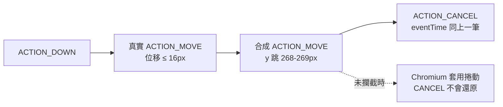

# Android 邊緣返回手勢的合成事件處理

[📈 專案](../../project.md) | [🏠 Wiki](../index.md)

## Summary

Android 手勢導航下，系統接管邊緣返回手勢時會注入一個座標大幅偏移的合成 `ACTION_MOVE`，
Chromium 會把它當成真實捲動照做，導致「往回滑時網頁被甩走」。本 fork 在
`InAppWebView.onTouchEvent` 前置守衛中丟棄該事件。**無設定項、無條件生效**，
且**僅** Android——這是與上游行為的一項刻意分歧。

## 系統為什麼要送那個事件

系統確認邊緣手勢屬於自己之後，必須讓 App 內使用 slop 判定的 View 主動放棄。它的做法是送出一個
位置被大幅位移的 `ACTION_MOVE`，緊接著送 `ACTION_CANCEL`（兩者 `eventTime` 相同、同一批送達）。

對一般 View 這是有效的——位移超過 slop，View 自己會放手。但 **Chromium 把它當成真實捲動輸入照做**，
而隨後的 `ACTION_CANCEL` **不會撤銷已套用的捲動**。

> [!IMPORTANT]
> **這不是 fling。** `CANCEL` 後 8–13ms 只出現**單獨一次**捲動事件；fling 會產生一連串遞減事件
> （正常滑動才是那個形態）。任何「中止 fling」方向的修法在此無事可做。

## 攔截條件

守衛只在**三個條件同時成立**時丟棄事件，其餘情況原樣轉交 `super`：

| 條件 | 判定方式 |
| :--- | :--- |
| 手勢**起點**落在系統手勢帶 | `ACTION_DOWN` 時以 `getRootWindowInsets()` 的 `Type.systemGestures()` 判定 x 是否在左右邊條內 |
| 單一事件位移超過門檻 | x 或 y 的變化量 > **48dp**（`GESTURE_ARTEFACT_THRESHOLD_DP`） |
| API 29 以上 | 手勢導航自 API 29 才有，以下直接不介入 |

門檻取 48dp 的依據（1080x2400、density 2.75 實測）：真實 MOVE 單事件位移 **≤ 16px**（約 6dp），
合成 MOVE 為 **268–269px**（約 98dp），相差一個數量級以上。

> [!NOTE]
> **丟棄時刻意不更新記錄的上一個座標。** 該事件對本手勢視同未發生；若更新，下一個真實事件會
> 相對假座標算出巨大位移而被連帶誤判。
>
> 即使門檻誤判也只掉**一個中間事件**——後續事件帶的是絕對座標，位置不會累積偏差。

## 為什麼沒有設定項

這是明確的錯誤行為，沒有使用端會想保留它；加開關等於為一個沒人要的行為增加與上游的 delta。

**連帶約束**：因為沒有逃生口，「正常捲動不受影響」是硬性條件而非加分項。已驗證的情境有二——
畫面中央的快速甩動捲動正常，以及**從螢幕最邊緣開始的正常垂直捲動**（最可能被誤傷者：
起點在手勢帶內、旗標成立）手感正常。

## 已知未驗證

- **鍵盤開著時做邊緣返回手勢**——這是本機制與[軟鍵盤避讓](keyboard-avoidance.md)唯一交會的路徑：
  守衛丟棄 `MOVE` 的同時，IME 動畫回呼正逐幀更新鍵盤高度。需真手指操作。
- 多指觸控、父層攔截等其他會產生 `ACTION_CANCEL` 的情境。
- 「合成 MOVE 與 CANCEL 共用 `eventTime`」是否為 Android 通用行為——僅在單一裝置觀察到。
  **現行修法不依賴此特徵**（改以位移門檻 + 手勢帶判定），故不構成風險。

## 驗證方法（重要）

> [!WARNING]
> **`adb shell input swipe` 測不出本問題。** 它直接注入事件、繞過系統手勢辨識器，
> 不會震動也不會發 `ACTION_CANCEL`。此路徑的驗證**必須由真實手指操作**。
>
> 另：**`View.getScrollY()` 在現代 WebView 上恆為 0**，不反映頁面捲動（內容捲動發生在
> Chromium 的 compositor 內），不可作為量測訊號。

## References

- 實作：`flutter_inappwebview_android/.../in_app_webview/InAppWebView.java:1604`（守衛呼叫點）、
  `:1637`（`shouldDropSystemGestureArtefact`）、`:1667`（`isInsideSystemGestureArea`）、
  `:131`（門檻常數）
- 相關節點：[軟鍵盤避讓](keyboard-avoidance.md)（兩者共用 `InAppWebView` 的觸控路徑）
- 歸檔計畫：[2608121440-back-gesture-fling](../../archive/2608121440-back-gesture-fling.md)

---

[📈 專案](../../project.md) | [🏠 Wiki](../index.md)
