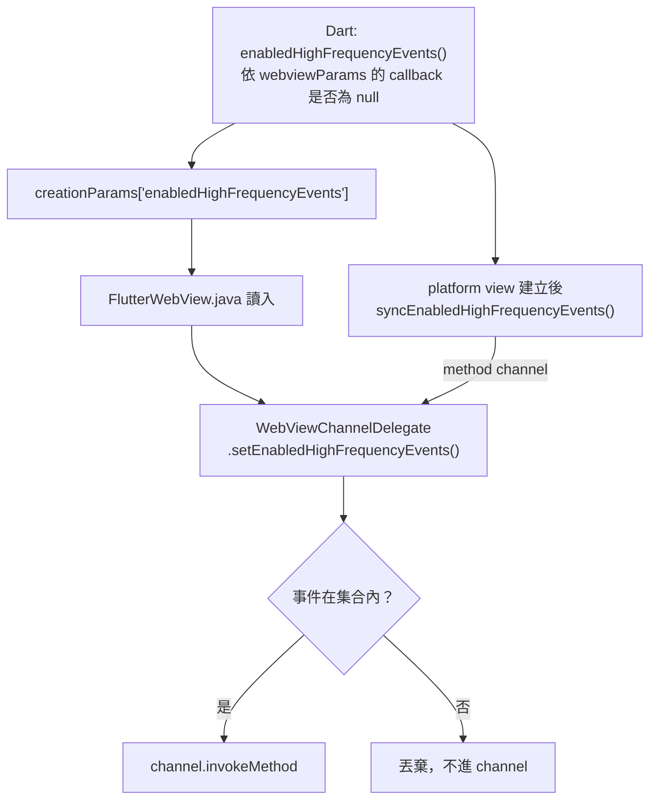

# Android 高頻事件 channel gating

[📈 專案](../../project.md) | [🏠 Wiki](../index.md)

## Summary

`onScrollChanged`、`onOverScrolled`、`onZoomScaleChanged` 在捲動時每幀觸發，Android 端因此
在送出前先確認 Dart 是否真的註冊了對應 callback，沒註冊就不送。判斷由 Dart 算出後隨
`creationParams` 傳入 native，**欄位缺席時一律視為全開（fail-open）**。僅 Android 有此機制。

## 為什麼需要

原本只要 `channelDelegate` 存在就 `invokeMethod`，不看 Dart 端有沒有監聽。捲動時那是每秒
60–120 次的跨執行緒訊息，每次都要付 `StandardMessageCodec` 編碼、跨執行緒、Dart 端解碼的成本
——而 Dart 端的 null 判斷是在訊息送達之後才做，成本已經付掉。

## 運作方式

`creationParams` 之外還會在 platform view 建立後經 method channel 重送一次，因為
`keepAlive` 的 WebView 會活得比建立它的 widget 久，可能被重新掛載到一個 callback 集合
不同的新 widget 上。

## fail-open 契約（改動時務必維持）

native 端以 `enabledHighFrequencyEvents == null` 表示「Dart 沒回報」，此時**全部照送**。
這讓所有未被此機制覆蓋的建立路徑行為完全不變：

| 建立路徑 | 是否帶欄位 | 結果 |
| :--- | :--- | :--- |
| `InAppWebView` widget | 是 | 依註冊情形 gate |
| `windowId` 新視窗 | 是 | 依註冊情形 gate |
| `HeadlessInAppWebView` | 否 | 全開 |
| `InAppBrowser` | 否 | 全開 |

Dart 端的 helper 在 `webviewParams == null` 或有 InAppBrowser handler 時同樣回傳全部事件
——InAppBrowser 的 controller 於建構期才綁定 handler，以「參數為 null 就全開」比依賴綁定
順序穩固。

> [!IMPORTANT]
> Dart 端 helper 的判斷式必須與 `AndroidInAppWebViewController.handleMethod` 中對應
> `case` 分支的守衛**完全一致**。那是同一個決定，只是提前到送出之前做；兩邊漂移會造成
> 事件靜默消失。

## References

- 歸檔計畫：[2608191735-webview-render-perf](../../archive/2608191735-webview-render-perf.md)

---

[📈 專案](../../project.md) | [🏠 Wiki](../index.md)
