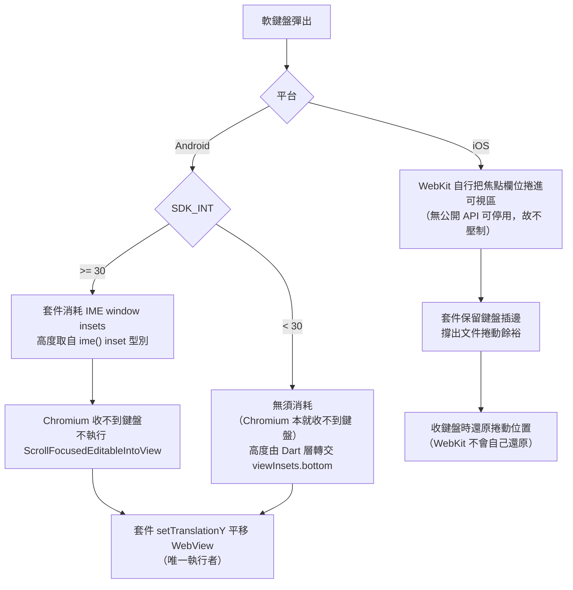

# 軟鍵盤避讓（keyboardAvoidance）

[📈 專案](../../project.md) | [🏠 Wiki](../index.md)

## Summary

軟鍵盤彈出時讓焦點輸入框保持可見，由套件內部完成，使用端零程式碼。設定項為
`InAppWebViewSettings.keyboardAvoidance`，**預設開啟**，支援 Android 與 iOS。
**兩平台是兩套不同機制**：Android 平移整個 WebView，iOS 不壓制 WebKit、
只補它缺的捲動餘裕與收鍵盤後的位置還原。使用端唯一要做的事是宣告
`Scaffold.resizeToAvoidBottomInset: false`——**Android 全版本適用**；iOS 僅限 17.2 以上，
更早的版本套件不介入，關掉 resize 會變成兩邊都不避讓。

## 使用端要做的事

只有一件——關掉 Flutter 的 resize（iOS 17.1 以下除外，見下方警示）：

```dart
Scaffold(
  resizeToAvoidBottomInset: false,
  body: InAppWebView(...),
)
```

套件做不到這件事：該 resize 是 Flutter framework 依 engine 的 `viewInsets` 進行的版面計算，
與套件攔截的通道各自獨立，無法從下層抑制。

不宣告也不會壞——焦點欄位一樣會可見——但 framework 會在鍵盤動畫的每一幀重新 layout WebView。
Android 實測（1080x2400、五個鍵盤週期，僅涵蓋 Flutter 層）：

| `Scaffold` resize | janky frames | 95th percentile |
| :--- | ---: | ---: |
| `true`（Flutter 預設） | 4.41% | 19ms |
| `false`（建議） | **0.00%** | **10ms** |

> [!CAUTION]
> **App 支援 iOS 17.1 以下時，該區間不得設為 `false`。**
> 那些版本上套件完全不介入（見「已知限制」），`false` 等於同時關掉唯一還在運作的避讓者：
> framework 被要求收手、套件沒站起來，焦點欄位直接被鍵盤蓋住，且**失效是靜默的**——
> 不擲例外。請於 iOS 17.1 以下保留預設 `true`，或依 OS 版本條件式設定。
>
> **Android 沒有這個但書**：全版本皆生效，可無條件設 `false`。

除此之外，使用端**不需要**自行平移 WebView、不需要自建焦點位置回報橋接、
也不需要 `interactive-widget=overlays-content` 這類 viewport meta。

## 平台機制



| 面向 | Android | iOS |
| :--- | :--- | :--- |
| 誰讓欄位可見 | **套件**（平移 WebView） | **WebKit**（捲動文件） |
| 套件的角色 | 取代平台行為（API 30+ 另需壓制 Chromium） | 補平台缺的兩段 |
| WebView 是否移動 | 是（整個 view 平移） | 否（只有文件捲動） |
| `visualViewport` 是否回報鍵盤 | **否**（見下方警告） | 是，正常回報 |
| 最低版本 | 無（全版本生效，機制分兩套） | iOS 17.2 |
| 可否於執行期啟用 | **否**，僅 `initialSettings`；關閉隨時可 | 可 |

> [!CAUTION]
> **Android：`visualViewport` 不再回報鍵盤。** WebView 從不知道鍵盤存在——API 30+ 是插邊被
> 套件消耗，以下是插邊根本沒送達（API 29 實測 system window 與 stable 底邊全程為 0）——
> `window.visualViewport` 的 `height` 與 `offsetTop` 在鍵盤開啟時因此維持不變。
> 任何靠「`visualViewport` 變矮」偵測鍵盤的網頁程式碼在 Android 上會**靜默失效**——
> 不報錯，只是永遠不觸發。要在 Android 偵測鍵盤需改走原生橋接。
> **iOS 不受此影響**，該平台的 `visualViewport` 行為與一般瀏覽器相同。

> [!NOTE]
> 原生 UI（`<select>` 下拉、游標與選取把手、選字浮動工具列）不受影響：
> 系統依真實的輸入法狀態定位，不看派送給 View 的插邊。

## Android 實作

> [!IMPORTANT]
> **本機制在 TLHC / HC / HCPP 三種合成模式下皆須成立。** 本 fork 的
> [平台視圖合成模式](android-platform-view-composition.md) 預設為**自動選擇**（HCPP 可用時
> 用 HCPP，否則 TLHC），因此實際跑到哪一條 IME 路徑取決於裝置與 app 是否 opt-in：
> TLHC 會啟用 `InputAwareWebView` 的 IME 代理，HC 與 HCPP 下那**四處**守衛直接交給 `super`。
> 避讓本身的插邊攔截與 `setTranslationY` 位移不依賴合成模式，
> 但輸入法連線走哪條路徑會因此不同——改動任一邊時三種模式都要驗。

不分版本共用的部分：

- 注入腳本 `KeyboardAvoidanceJS` 回報焦點元素位置，走專屬 `@JavascriptInterface` 而非
  `callHandler`——後者需往返 Dart，趕不上鍵盤動畫。
- `KeyboardAvoidanceController` 以鍵盤高度計算位移並夾在鍵盤高度以內，
  由 `setTranslationY` 套用於 WebView 本身（內容不重排）。該計算以視窗座標進行，
  **無 API 級別相依**，兩條路徑共用同一份。
- 關閉時 `setKeyboardAvoidanceEnabled(false)` 把監聽器設回 `null` 並 reset controller，
  行為等同沒有這個選項。

差異只在「鍵盤高度從哪來」與「要不要壓制 Chromium」：

| | API 30+ | API 30 以下 |
| :--- | :--- | :--- |
| 高度來源 | `ViewCompat.getRootWindowInsets()` 的 `Type.ime()` | Dart 層 `didChangeMetrics` 轉交 `FlutterView.viewInsets.bottom` |
| 逐幀更新 | `setWindowInsetsAnimationCallback` | `didChangeMetrics`（鍵盤動畫期間每幀觸發） |
| 壓制 Chromium | **需要**，`setInsets(Type.ime(), NONE)` | **不需要**，該區間 Chromium 收不到鍵盤、本就不動作 |

> [!IMPORTANT]
> **API 30+：鍵盤高度有兩個來源，用錯會讓欄位被切掉。** 派送到 WebView 的 `insets` 已被祖先
> 消耗掉導航列手勢區那一段（實測差 66px）；位移是在**視窗座標**下計算的，故**量測**必須取
> `ViewCompat.getRootWindowInsets()`，而**消耗**仍作用於派送來的 `insets`。兩者不可混用。

> [!IMPORTANT]
> **API 30 以下為何不能在原生端自己量。** 三條通道都不可用：type-based insets 在 pre-R
> 沒有 `ime()` 值；`getSystemWindowInsets()` / `getStableInsets()` 的底邊實測全程為 0
> （Flutter embedding 在 FlutterView 層就把插邊消耗掉，子 View 收不到）；
> root view 的 visible display frame 雖然會變，但要靠 layout pass 才讀得到，而使用端一旦
> 依建議設 `resizeToAvoidBottomInset: false`，view 樹就不會重排、監聽器永遠不響。
> engine 握有正確值（framework 自己的 resize 能在 API 29 正確運作即為證據），故由 Dart 端轉交。

> [!WARNING]
> **pre-R 實作的兩個陷阱**（改動此路徑時務必留意）：
> `getInsetsIgnoringVisibility(Type.systemBars())` 會打到 API 30 才公開的平台隱藏方法，
> 被 blacklist 擋下並中斷整個插邊派送（症狀是整個 App 空白）；
> `getViewTreeObserver()` 在 View 尚未 attach 時回傳暫時性 VTO，attach 後會被換掉，
> 掛上去的監聽器只會在啟動時響幾次就再也不觸發。

## iOS 實作

- `keyboardWillShow`：啟用時保留鍵盤插邊（那是文件的捲動餘裕來源，短頁面沒有它就捲不動、
  欄位會被蓋住），並捕捉當下的 `contentOffset`。
- `keyboardWillHide`：還原 `contentInset`，並**延後一個 runloop**再還原捲動位置。

還原前必須通過兩道閘門，否則會在使用者仍與頁面互動時把畫面拉走：

1. **鍵盤是否又出現**（session token）——那代表這次收起是欄位間切換焦點，不是離開輸入。
2. **畫面上是否有原生浮層**（`presentedViewController`）——點 `<select>` 時鍵盤會收起但
   浮層已錨定於當下位置，此時捲動會把元素從浮層底下抽走。

> [!WARNING]
> **first responder 無法用於此判斷。** 實測（iOS 26）`blur()` 之後與 `<select>` 浮層開啟期間，
> WebView 子樹的 `isFirstResponder` **皆為 true**，兩種情境分不開。
>
> 另有一條不變式：**一個捕捉的位置只能被捕捉它的那個鍵盤週期還原**。決定不還原的路徑
> 必須清除捕捉值，否則下一個週期會繼承過期錨點，還原到兩次互動前的位置。

## 已知限制

- **Android 只能於 `initialSettings` 啟用**。注入腳本在 `prepare()` 時登記，重載只重新注入
  已登記者，事後補不回來；只套用插邊攔截會消音 Chromium 卻無人接手位移，比不開更糟，
  故 `setSettings` 偵測到 `false → true` 時記 warning 並**拒絕套用**。關閉方向不受限。
- **iOS 17.2 以下忽略此選項**，該區間使用端必須讓 `Scaffold.resizeToAvoidBottomInset`
  維持 `true`，否則沒有任何一方在避讓（見上方「使用端要做的事」的警示）。
  **Android 已無版本下限**。
- **autofill 建議下拉未驗證**——測試裝置無 autofill 資料，無候選即無下拉。
- **API 30 以下的迴歸驗證以模擬器為主**：pre-R 路徑於 Urovo U2（API 29）實機驗證；
  API 30+ 的迴歸則於 API 36 模擬器完成，未於 R+ 實體裝置複驗。
- **各合成模式的實機複驗涵蓋範圍不同**：TLHC 於 U2（API 29）以真輸入法實機確認；
  HCPP 於 Android 16 平板以注音輸入法實機確認（composing、候選字列、焦點框保持可見）。
  **API 30+ 搭配 TLHC、以及 HC 模式，皆尚未於實體裝置複驗**。

## References

- 相關節點：[Android 平台視圖合成模式](android-platform-view-composition.md)
  （預設的 TLHC 會啟用本功能所依賴的 IME 代理路徑；HC 與 HCPP 則不走該路徑）
- 相關節點：[Android 邊緣返回手勢的合成事件處理](android-back-gesture.md)
  （兩者共用 `InAppWebView` 的觸控路徑；**鍵盤開著時做邊緣返回手勢**是唯一的交會點，尚未驗證）
- 歸檔計畫：[2608111609-webview-keyboard-avoidance](../../archive/2608111609-webview-keyboard-avoidance.md)、
  [2608140927-keyboard-avoidance-pre-r](../../archive/2608140927-keyboard-avoidance-pre-r.md)
  （解除 Android 的 API 30 下限）
- [OBSOLETE] [2608132314-keyboard-avoidance-unsupported-os-doc](../../archive/2608132314-keyboard-avoidance-unsupported-os-doc.md)
  ——其記載的 Android 限制已由上一項解除，僅 iOS 部分仍成立；保留為歷史紀錄。
- 上游 issue #1947（iOS `contentInset` 修正的來源）：`https://github.com/pichillilorenzo/flutter_inappwebview/issues/1947`

---

[📈 專案](../../project.md) | [🏠 Wiki](../index.md)
