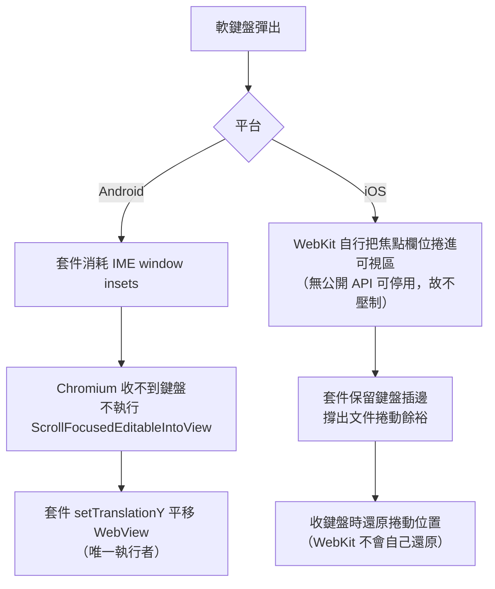

# 軟鍵盤避讓（keyboardAvoidance）

[📈 專案](../../project.md) | [🏠 Wiki](../index.md)

## Summary

軟鍵盤彈出時讓焦點輸入框保持可見，由套件內部完成，使用端零程式碼。設定項為
`InAppWebViewSettings.keyboardAvoidance`，**預設開啟**，支援 Android 與 iOS。
**兩平台是兩套不同機制**：Android 壓制 Chromium 後自行平移 WebView，iOS 不壓制 WebKit、
只補它缺的捲動餘裕與收鍵盤後的位置還原。使用端唯一要做的事是宣告
`Scaffold.resizeToAvoidBottomInset: false`，但**僅限本功能實際生效的 OS 版本**
（Android 11 / iOS 17.2 以上），否則會變成兩邊都不避讓。

## 使用端要做的事

只有一件——在**支援的 OS 版本上**關掉 Flutter 的 resize：

```dart
Scaffold(
  resizeToAvoidBottomInset: false,
  body: InAppWebView(...),
)
```

套件做不到這件事：該 resize 是 Flutter framework 依 engine 的 `viewInsets` 進行的版面計算，
與套件攔截的通道各自獨立，無法從下層抑制。

不宣告也不會壞——焦點欄位一樣會可見——但 framework 會在鍵盤動畫的每一幀重新 layout WebView。
Android 實測（1080x2400、五個鍵盤週期，僅涵蓋 Flutter 層）：

| `Scaffold` resize | janky frames | 95th percentile |
| :--- | ---: | ---: |
| `true`（Flutter 預設） | 4.41% | 19ms |
| `false`（支援版本上建議） | **0.00%** | **10ms** |

> [!CAUTION]
> **App 支援 Android 10 以下或 iOS 17.1 以下時，不得無條件設為 `false`。**
> 那些版本上套件完全不介入（見「已知限制」），`false` 等於同時關掉唯一還在運作的避讓者：
> framework 被要求收手、套件沒站起來，焦點欄位直接被鍵盤蓋住。
>
> 這個失效是**靜默的**——不擲例外，唯一線索是 Android 端的 `Log.d`，而該層級常被 ROM 濾掉
> （實測於 Android 10 裝置完全看不到）。請保留預設 `true`，或依 OS 版本條件式設定。

除此之外，使用端**不需要**自行平移 WebView、不需要自建焦點位置回報橋接、
也不需要 `interactive-widget=overlays-content` 這類 viewport meta。

## 平台機制



| 面向 | Android | iOS |
| :--- | :--- | :--- |
| 誰讓欄位可見 | **套件**（平移 WebView） | **WebKit**（捲動文件） |
| 套件的角色 | 壓制平台行為並取而代之 | 補平台缺的兩段 |
| WebView 是否移動 | 是（整個 view 平移） | 否（只有文件捲動） |
| `visualViewport` 是否回報鍵盤 | **否**（見下方警告） | 是，正常回報 |
| 最低版本 | API 30（Android 11） | iOS 17.2 |
| 可否於執行期啟用 | **否**，僅 `initialSettings`；關閉隨時可 | 可 |

> [!CAUTION]
> **Android：`visualViewport` 不再回報鍵盤。** 因為 WebView 從不知道鍵盤存在，
> `window.visualViewport` 的 `height` 與 `offsetTop` 在鍵盤開啟時維持不變。
> 任何靠「`visualViewport` 變矮」偵測鍵盤的網頁程式碼在 Android 上會**靜默失效**——
> 不報錯，只是永遠不觸發。要在 Android 偵測鍵盤需改走原生橋接。
> **iOS 不受此影響**，該平台的 `visualViewport` 行為與一般瀏覽器相同。

> [!NOTE]
> 原生 UI（`<select>` 下拉、游標與選取把手、選字浮動工具列）不受影響：
> 系統依真實的輸入法狀態定位，不看派送給 View 的插邊。

## Android 實作

- `InputAwareWebView.setKeyboardAvoidanceEnabled()` 以 `ViewCompat.setOnApplyWindowInsetsListener`
  消耗 IME 那一段插邊；關閉時監聽器設回 `null`，**完全不安裝**，行為等同沒有這個選項。
- 注入腳本 `KeyboardAvoidanceJS` 回報焦點元素位置，走專屬 `@JavascriptInterface` 而非
  `callHandler`——後者需往返 Dart，趕不上鍵盤動畫。
- `KeyboardAvoidanceController` 以插邊高度計算位移並夾在鍵盤高度以內，
  由 `setTranslationY` 套用於 WebView 本身（內容不重排）。

> [!IMPORTANT]
> **鍵盤高度有兩個來源，用錯會讓欄位被切掉。** 派送到 WebView 的 `insets` 已被祖先消耗掉
> 導航列手勢區那一段（實測差 66px）；位移是在**視窗座標**下計算的，故**量測**必須取
> `ViewCompat.getRootWindowInsets()`，而**消耗**仍作用於派送來的 `insets`。兩者不可混用。

## iOS 實作

- `keyboardWillShow`：啟用時保留鍵盤插邊（那是文件的捲動餘裕來源，短頁面沒有它就捲不動、
  欄位會被蓋住），並捕捉當下的 `contentOffset`。
- `keyboardWillHide`：還原 `contentInset`，並**延後一個 runloop**再還原捲動位置。

還原前必須通過兩道閘門，否則會在使用者仍與頁面互動時把畫面拉走：

1. **鍵盤是否又出現**（session token）——那代表這次收起是欄位間切換焦點，不是離開輸入。
2. **畫面上是否有原生浮層**（`presentedViewController`）——點 `<select>` 時鍵盤會收起但
   浮層已錨定於當下位置，此時捲動會把元素從浮層底下抽走。

> [!WARNING]
> **first responder 無法用於此判斷。** 實測（iOS 26）`blur()` 之後與 `<select>` 浮層開啟期間，
> WebView 子樹的 `isFirstResponder` **皆為 true**，兩種情境分不開。
>
> 另有一條不變式：**一個捕捉的位置只能被捕捉它的那個鍵盤週期還原**。決定不還原的路徑
> 必須清除捕捉值，否則下一個週期會繼承過期錨點，還原到兩次互動前的位置。

## 已知限制

- **Android 只能於 `initialSettings` 啟用**。注入腳本在 `prepare()` 時登記，重載只重新注入
  已登記者，事後補不回來；只套用插邊攔截會消音 Chromium 卻無人接手位移，比不開更糟，
  故 `setSettings` 偵測到 `false → true` 時記 warning 並**拒絕套用**。關閉方向不受限。
- **Android API 30 以下、iOS 17.2 以下忽略此選項**（Android 記 `Log.d`，不佯裝有效）。
  Android 的理由：IME 插邊自 API 30 才是獨立的 inset type，更早版本與導航列混在一起，
  硬拆等於猜測。**這些版本上使用端必須讓 `Scaffold.resizeToAvoidBottomInset` 維持 `true`**，
  否則沒有任何一方在避讓（見上方「使用端要做的事」的警告）。
- **autofill 建議下拉未驗證**——測試裝置無 autofill 資料，無候選即無下拉。

## References

- 歸檔計畫：[2608111609-webview-keyboard-avoidance](../../archive/2608111609-webview-keyboard-avoidance.md)、
  [2608132314-keyboard-avoidance-unsupported-os-doc](../../archive/2608132314-keyboard-avoidance-unsupported-os-doc.md)
  （不支援 OS 版本上的 `resizeToAvoidBottomInset` 條件）
- 上游 issue #1947（iOS `contentInset` 修正的來源）：`https://github.com/pichillilorenzo/flutter_inappwebview/issues/1947`

---

[📈 專案](../../project.md) | [🏠 Wiki](../index.md)
