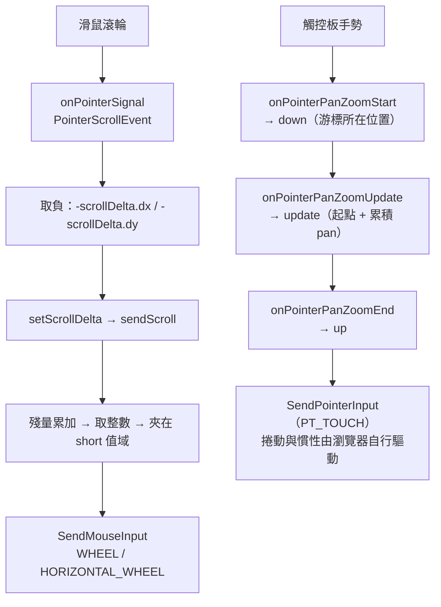

# Windows 捲動輸入

[📈 專案](../../project.md) | [🏠 Wiki](../index.md)

## Summary

Windows 的 WebView2 以 composition 模式繪製到 texture，不在 hit-test 樹中，**所有輸入都由
Flutter 端合成後送進去**。捲動有兩條路徑：滑鼠滾輪合成為 wheel 事件，**觸控板手勢則合成為
觸控接觸點**，讓瀏覽器自己驅動捲動——慣性與斜滑同時捲兩軸因此都成立。
其他平台不需要這一套（macOS 的 `AppKitView` 由 AppKit 直接派送事件）。

## 為什麼只有 Windows 需要

| 平台 | WebView 在視圖樹中的身分 | 輸入來源 |
| :--- | :--- | :--- |
| Windows | composition 模式，繪製到 texture，**不是真實視窗** | Flutter 端 `Listener` 合成後經 method channel 送入 |
| macOS | `AppKitView`，**真正的原生 view** | AppKit 直接派送 `NSEvent`，`InAppWebView.swift` 連 `scrollWheel` 都未覆寫 |

因此本頁的所有內容**僅適用於 Windows**，不得外推到其他平台。

## 兩條輸入路徑

### 觸控板：合成觸控接觸點

手勢被當成一根手指的觸控接觸點交給 WebView2，走的是套件原本服務於觸控螢幕的
`InAppWebView::setPointerUpdate`。座標為手勢起點加上累積的 `pan`，**不做任何符號轉換**——
觸控接觸點跟著手指走，`pan` 也是。pointer id 直接取自 Flutter 事件，不與真實觸控衝突。

慣性由瀏覽器依 `up` 之前的座標序列自行計算，套件不合成任何衰減曲線。

> [!IMPORTANT]
> **頁面收到的是 `touchstart` / `touchmove` / `touchend`，不是 `wheel`。**
> 實測（2026-08-16）顯示這不影響常見的裝置判斷：CSS `:hover`、Pointer Events 拖曳、
> `maxTouchPoints`、`ontouchstart`、`(hover: hover)`、`(pointer: coarse)` 全部維持不變，
> 因為那些反映的是實體裝置能力。**但以「收到過 `touchstart` 就記旗標」判定觸控的網站會被觸發。**

### 滑鼠：合成 wheel 事件

滾輪路徑取負後進 `sendScroll`，送出前做兩件事：

- **殘量累加**：`mouseData` 只能是整數，不足一個單位的部分逐幀累加而非丟棄；整數部分為 0 時不送。
- **溢位飽和**：`scrollMultiplier` 為無上限的 `int64_t`，轉型為 `short` 前先夾在值域內，
  否則大值會繞回反號、變成倒著捲。

## 使用端可調的設定

`InAppWebViewSettings.scrollMultiplier`（Windows 專用，預設 `1`）**僅作用於滑鼠滾輪**。
觸控板不經過它——那條路徑的捲動距離由實際的手指位移決定，乘上係數等於偽造手指移動速度，
會讓瀏覽器算出失真的慣性。

## 已知限制

- **原生 HTML5 `draggable` 拖放不可用**（游標顯示為禁止）。composition 模式的 WebView2 需
  另接 OLE drop target，套件未實作。**與捲動路徑無關，兩種輸入下皆如此。**
  Pointer Events 實作的拖曳不受影響，正常可用。
- **`scrollMultiplier` 的溢位飽和未經實測**：程式碼層面已夾在 `short` 值域內，但未以極端值實跑。
- **真實觸控螢幕未實測**：合成觸控與觸控螢幕共用 `setPointerUpdate`，但 pointer id 取自各自
  的事件、狀態不共用；無觸控裝置可驗證。

## References

- 歸檔計畫：[2608152118-windows-trackpad-scroll](../../archive/2608152118-windows-trackpad-scroll.md)
  （滾輪路徑的修復與根因）、
  [2608152335-windows-trackpad-pointer-input](../../archive/2608152335-windows-trackpad-pointer-input.md)
  （觸控板改走合成觸控）
- 同檔案的另一條路徑（幾何上報與 texture 更新）：[Windows 視圖幾何與 texture 更新](windows-view-geometry.md)
- 上游未修的相關 issue：`https://github.com/pichillilorenzo/flutter_inappwebview/issues/2511`、
  `https://github.com/pichillilorenzo/flutter_inappwebview/issues/2503`
- Flutter 觸控板手勢語意：`https://docs.flutter.dev/release/breaking-changes/trackpad-gestures`

---

[📈 專案](../../project.md) | [🏠 Wiki](../index.md)
