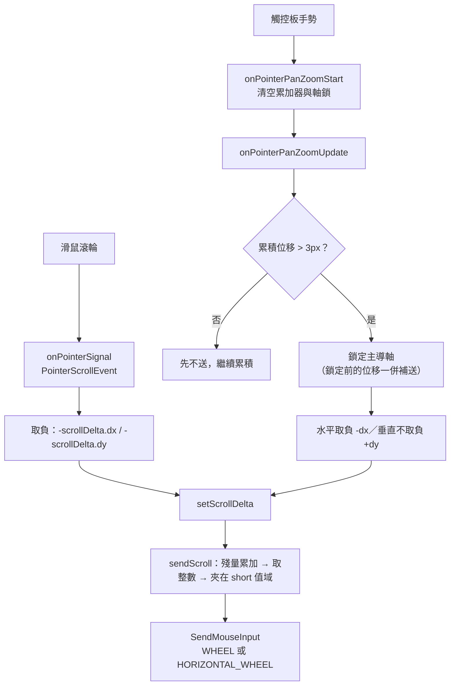

# Windows 捲動輸入

[📈 專案](../../project.md) | [🏠 Wiki](../index.md)

## Summary

Windows 的 WebView2 以 composition 模式繪製到 texture，不在 hit-test 樹中，**所有輸入都由
Flutter 端合成後送進去**——捲動即是把滑鼠滾輪與觸控板手勢翻譯成 `SendMouseInput` 的 wheel 事件。
觸控板手勢**每次鎖定單一主導軸**，因為兩軸交錯送出會讓 Chromium 吃掉垂直捲動。
其他平台不需要這一套（macOS 的 `AppKitView` 由 AppKit 直接派送事件）。

## 為什麼只有 Windows 需要

| 平台 | WebView 在視圖樹中的身分 | 輸入來源 |
| :--- | :--- | :--- |
| Windows | composition 模式，繪製到 texture，**不是真實視窗** | Flutter 端 `Listener` 合成後經 method channel 送入 |
| macOS | `AppKitView`，**真正的原生 view** | AppKit 直接派送 `NSEvent`，`InAppWebView.swift` 連 `scrollWheel` 都未覆寫 |

因此本頁的所有內容**僅適用於 Windows**，不得外推到其他平台。

## 兩條輸入路徑

`custom_platform_view.dart` 的 `Listener` 有兩個各自獨立的捲動入口，最後都收斂到原生的
`InAppWebView::sendScroll`：

### 符號：兩軸不一致，且是刻意的

| 來源 | 水平 | 垂直 |
| :--- | :--- | :--- |
| 滑鼠 `scrollDelta` | 取負 | 取負 |
| 觸控板 `panDelta` | **取負** | **不取負** |

原因是 wheel 的兩軸對「正值」的定義本就不同——**垂直正值＝畫面往上，水平正值＝畫面往右**——
而 `panDelta` 兩軸都是「內容跟著手指走」。手指往下（`+dy`）要的是畫面往上，剛好是正的垂直 wheel；
手指往右（`+dx`）要的是畫面往左，那是負的水平 wheel。

> [!WARNING]
> 這個不一致看起來像 bug，實際兩個方向都經實機驗證。**改成兩軸一致會讓其中一軸反向。**

## 軸鎖定

觸控板每次手勢只送**一個**軸的事件。

原因：觸控板幾乎每一幀都帶有微小的垂直分量之外的水平分量，若兩軸交錯送出，Chromium 會把整段
序列當成水平捲動，**垂直位移被整個丟掉**——表現為某個方向完全推不動。

鎖定的粒度是**整個手勢**，不是逐幀：逐幀判定會讓次要軸偶然勝出的那些幀被送到錯誤的軸，
該幀的位移就此漏失，表現為「滑很大一段只捲一點點」。

判定放在 Dart 端，因為手勢的起訖（`onPointerPanZoomStart` / `End`）只有那裡知道；
原生的 `setScrollDelta` 因此維持上游原樣。門檻為累積位移 3 邏輯像素，**鎖定前累積的位移會一併補送**。

## 原生端的數值處理

`InAppWebView::sendScroll` 在送出前做三件事：

- **殘量累加**：`SendMouseInput` 的 `mouseData` 只能是整數，不足一個單位的部分逐幀累加而非丟棄。
  觸控板的水平分量常在 0.1–8 之間，直接截斷會讓慢速捲動一點一點消失。
- **零值不送**：整數部分為 0 時完全不呼叫，避免送出無意義的空事件。
- **溢位飽和**：`scrollMultiplier` 為無上限的 `int64_t`，轉型為 `short` 前先夾在值域內，
  否則大值會繞回反號、變成倒著捲。

殘量在 `onPointerPanZoomStart` / `End` 經 `resetScrollRemainder` 清空，
避免上一次手勢的餘數漏進下一次的第一幀。

## 使用端可調的設定

`InAppWebViewSettings.scrollMultiplier`（Windows 專用，預設 `1`）會乘在 delta 上。
覺得捲動偏慢時可調，但**不要設到極大值**——雖然已有溢位飽和，過大的值只會讓每一幀都撞到上限，
捲動變成等速跳動。

## 已知限制

- **沒有慣性**：手指離開後畫面立刻停止，沒有逐漸減速。Windows 的觸控板慣性事件流並未送達
  Flutter（實測手指離開後只剩幾幀 <1px 的殘值），而合成滾輪也無法表達 fling。
- **斜滑無法同時捲兩軸**：`SendMouseInput` 一次只能表達一個軸，故斜滑只會走主導軸。
  瀏覽器能同時捲兩軸，是因為它收到的是帶 x/y 分量的單一手勢事件。
- 上述兩項的正解都是改走 `SendPointerInput`（讓 Chromium 走原生 fling 路徑），
  但那會使頁面收到 `touchstart/touchmove` 與 `pointerType: touch`，網站可能切換為行動版互動。
  尚未實作。
- **`scrollMultiplier` 的溢位飽和未經實測**：程式碼層面已夾在 `short` 值域內，但未以極端值實跑驗證。

## References

- 歸檔計畫：[2608152118-windows-trackpad-scroll](../../archive/2608152118-windows-trackpad-scroll.md)
- 上游未修的相關 issue：`https://github.com/pichillilorenzo/flutter_inappwebview/issues/2511`、
  `https://github.com/pichillilorenzo/flutter_inappwebview/issues/2503`
- Flutter 觸控板手勢語意：`https://docs.flutter.dev/release/breaking-changes/trackpad-gestures`

---

[📈 專案](../../project.md) | [🏠 Wiki](../index.md)
