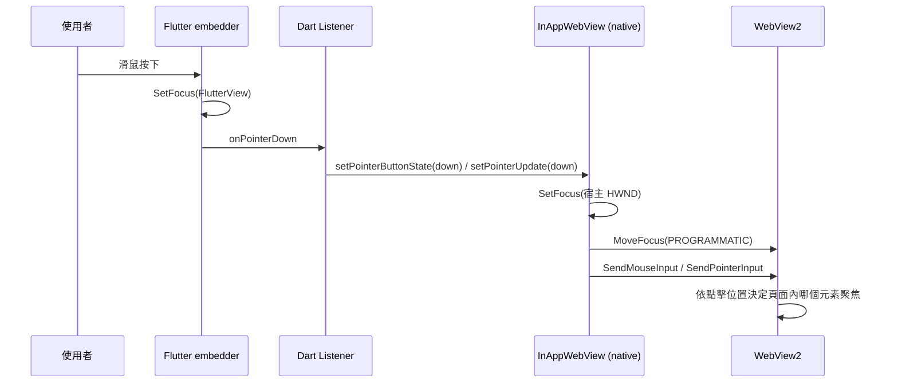

# Windows WebView 焦點模型

[📈 專案](../../project.md) | [🏠 Wiki](../index.md)

## Summary

Windows 的 WebView2 有一個**不可見的宿主 HWND**，它是 FlutterView 的子視窗（`WS_CHILD`），
承載 Win32 焦點、鍵盤與 IME，並決定 WebView2 自繪彈出物的落點。焦點不會自動交付——每次
pointer down 由套件明確呼叫 `SetFocus` + `MoveFocus` 交給 WebView2。

## 宿主 HWND 的三個角色

畫面走 texture，這個視窗**從不被畫出來**（沒有 `WS_VISIBLE`）。它存在是為了：

1. **持有 Win32 焦點** —— 鍵盤事件與 IME 不經 Flutter，由 WebView2 透過這個視窗自行取得。
2. **定位原生彈出物** —— `<select>` 下拉、右鍵選單、自動填入、IME 候選字視窗由 WebView2
   自繪為獨立視窗，位置以宿主視窗為基準。這就是 `setPosition` 存在的理由。
3. **作為 composition controller 的 parent** —— `CreateCoreWebView2CompositionController`
   的第一個參數。

> [!CAUTION]
> **`WS_CHILD` 不可拿掉，`WS_VISIBLE` 不可加上。** 兩者都會直接破功：
>
> - **少了 `WS_CHILD`**：Win32 只把 `hWndParent` 當 owner，宿主會是**頂層視窗**。對它
>   `SetFocus` 等於啟用另一個頂層視窗，Flutter 主視窗被停用（標題列變灰），下一次點擊
>   重新啟用主視窗，runner 的 `WM_ACTIVATE` 又把焦點拉回 FlutterView。
> - **多了 `WS_VISIBLE`**：可見的子視窗會疊在 FlutterView 之上並攔截滑鼠訊息，而本外掛的
>   輸入**全部**倚賴 Flutter 端的 `Listener` 合成後送入（見 [Windows 捲動輸入](windows-scroll-input.md)），
>   等於整條輸入路徑斷掉。

## 焦點交付：必須明確執行

composition controller（windowless）模式下，`SendMouseInput` 與 `SendPointerInput`
**只送輸入事件，不含焦點語意**。WebView2 不會自己去搶 Win32 焦點，宿主必須：

1. `::SetFocus(宿主 HWND)` —— `MoveFocus` 要生效，宿主視窗本身得先持有 Win32 焦點。
2. `MoveFocus(COREWEBVIEW2_MOVE_FOCUS_REASON_PROGRAMMATIC)` —— WebView2 內部的焦點交付。

**順序不可對調**：先交付焦點、再送輸入事件，頁面內「點哪個元素就聚焦哪個」才由 WebView2
自己處理，套件不介入頁面內的焦點語意。

滑鼠與觸控是兩條獨立路徑（`setPointerButtonState` 與 `setPointerUpdate`），**兩條都要**。

### 為什麼是無條件執行

embedder 在**每一次**滑鼠按下都會 `SetFocus(FlutterView)`。若只在「首次」交付焦點，第二下
點在同一個已聚焦的元素上時，WebView2 判定焦點沒變而不動作，焦點就留在 FlutterView——症狀
是游標消失、打不了字。`SetFocus` 與 `MoveFocus` 皆為冪等操作，成本可忽略；加條件判斷等於
自行維護一份必然與 Win32 真實狀態漂移的焦點狀態。

## 焦點如何交還

點到 WebView 以外的 Flutter 元件時**不需要**任何額外處理：embedder 本就會
`SetFocus(FlutterView)`，宿主 HWND 收到 `WM_KILLFOCUS`，WebView2 自然放掉焦點。

## Headless 不適用

`HeadlessInAppWebView` 的宿主視窗建立後立即 `ShowWindow(SW_HIDE)`。隱藏的視窗無法被啟用，
也沒有使用者輸入，本頁的焦點路徑對它不適用。

## References

- 歸檔計畫：[2608201704-windows-webview-focus](../../archive/2608201704-windows-webview-focus.md)
- 同一個宿主視窗的另一條路徑（尺寸與位置上報）：[Windows 視圖幾何與 texture 更新](windows-view-geometry.md)
- 輸入合成路徑：[Windows 捲動輸入](windows-scroll-input.md)
- WebView2 visual hosting 焦點契約：`https://learn.microsoft.com/microsoft-edge/webview2/concepts/windowless-hosting`

---

[📈 專案](../../project.md) | [🏠 Wiki](../index.md)
